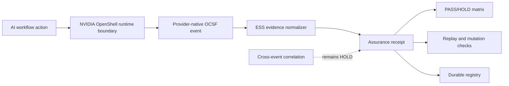

# Buyer-safe architecture diagram

No internal implementation details, credentials or private repository structure are shown.

## Buyer interpretation
- OpenShell is the runtime source for provider-native evidence.
- ESS does not replace OpenShell and does not claim equivalence.
- ESS consumes evidence, builds receipts, and fails closed when a bound evidence field is changed.
- Cross-event causality is not claimed unless the provider supplies native correlation evidence.
